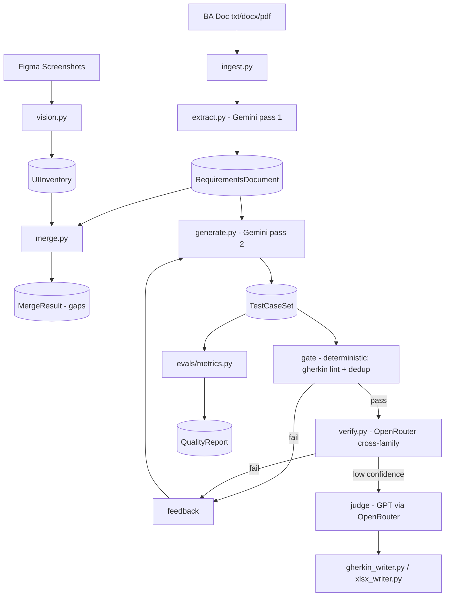

# System Architecture

## Components

| Module | Role |
|--------|------|
| `apps/api/models/` | Pydantic schemas (requirements, ui_inventory, merge_gap, test_case, verdict) |
| `apps/api/pipeline/ingest.py` | Document parsing (txt/docx/pdf) |
| `apps/api/pipeline/extract.py` | LLM pass 1: requirements extraction w/ explicit/inferred tags |
| `apps/api/pipeline/vision.py` | Screenshot -> UIInventory (visible elements only) |
| `apps/api/pipeline/merge.py` | Feature<->screen mapping + 3 gap types |
| `apps/api/pipeline/generate.py` | LLM pass 2: test case generation + Gherkin validation |
| `apps/api/pipeline/model_router.py` | Role-based routing: generate=Gemini, verify=Claude, judge=GPT |
| `apps/api/pipeline/verify.py` | Cross-family verification (no generator reasoning in prompt) |
| `apps/api/pipeline/loop.py` | gate -> verify -> judge -> retry, budget + no-progress stop |
| `apps/api/evals/metrics.py` | 9-metric `evaluate_all()` -> QualityReport (blended faithfulness, new weights) |
| `apps/api/evals/gate.py` | Deterministic gate: Gherkin parse + text duplication |
| `apps/api/evals/semantic.py` | SBERT metrics: semantic consistency, semantic faithfulness, semantic dedup |
| `apps/api/evals/proxy_mutation.py` | LLM-judged proxy-mutation score (max 5 TC sample, graceful degrade) |
| `apps/api/evals/calibration.py` | Cohen's kappa vs `labeled_bad.json` |
| `apps/api/server.py` | FastAPI: pipeline endpoints + job polling + export |
| `apps/cli.py` | Standalone CLI demo (`python -m apps.cli run <doc>`) |
| `apps/web/` | Next.js UI: upload -> progress -> gaps -> TCs -> quality -> export |

## Data Stores
- In-memory job store (dict) in server — v1; Redis in v2
- Versioned prompt files in `apps/api/prompts/`
- Golden dataset in `apps/api/evals/datasets/golden/`
